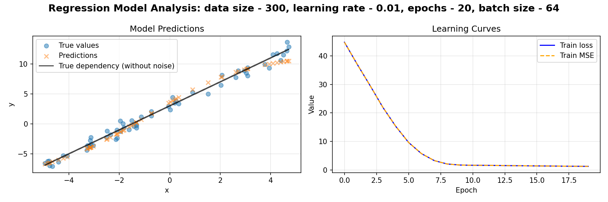
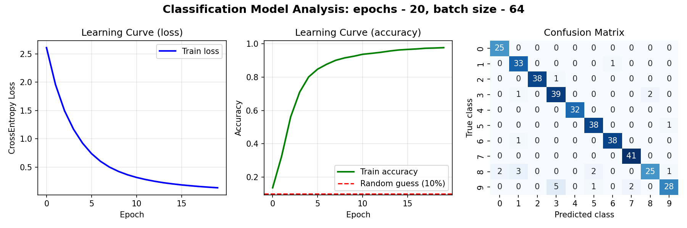

# Лабораторная работа по курсу "Искусственный интеллект"

## Создание своего нейросетевого фреймворка

## Команда

| ФИО | Роль в проекте | Зона ответственности |
|---|---|---|
| Дьяченко Елизавета | Тимлид / интегратор | Архитектура проекта, структура репозитория, интеграция модулей, README, финальная сборка, видео |
| Глушко Игорь | Разработчик ядра | `nn/base.py`, `nn/layers.py`, `nn/activations.py`, `nn/sequential.py` |
| Ильинский Никита | Разработчик обучения | `nn/losses.py`, `nn/optimizers.py`, `nn/trainer.py`, `nn/metrics.py` |
| Канева Юлия | Данные, примеры, demo | `nn/data.py`, `examples/*`, `demo/app.py`, графики и визуализация |

---

## Описание проекта

В рамках лабораторной работы был разработан собственный мини-фреймворк для обучения **полносвязных нейронных сетей** на **Python + NumPy**.

Фреймворк поддерживает:
- создание многослойной сети через перечисление слоёв;
- прямой и обратный проход;
- обучение с помощью нескольких оптимизаторов;
- функции потерь для задач классификации и регрессии;
- базовые инструменты для работы с данными;
- обучение модели в несколько строк через `Trainer`;
- примеры на классических задачах;
- визуальную демонстрацию через Streamlit.

---

## Цель работы

Реализовать собственный нейросетевой фреймворк для обучения полносвязных нейросетей без использования готовых deep learning библиотек, а также показать его работу на нескольких задачах и оформить удобную демонстрацию.

---

## Основные возможности фреймворка

### Базовые сущности
- `Parameter`
- `Module`
- `Sequential`

### Слои
- `Linear`

### Функции активации
- `ReLU`
- `Sigmoid`
- `Tanh`

### Функции потерь
- `MSELoss`
- `CrossEntropyLoss`

### Оптимизаторы
- `SGD`
- `Momentum`
- `Adam`

### Метрики
- `Accuracy`
- `MeanSquaredError`

### Работа с данными
- `train_test_split`
- `normalize_features`
- `shuffle_data`
- `batch_iterator`
- `one_hot_conversion`

### Обучение
- `Trainer.fit(...)`

---

## Структура проекта

```text
ML_lab2/
├── nn/
│   ├── __init__.py
│   ├── base.py
│   ├── layers.py
│   ├── activations.py
│   ├── losses.py
│   ├── optimizers.py
│   ├── sequential.py
│   ├── trainer.py
│   ├── data.py
│   ├── metrics.py
│   └── utils.py
│
├── examples/
│   ├── iris_example.py
│   ├── regression_example.py
│   └── mnist_example.py
│
├── demo/
│   └── app.py
│
├── tests/
│   ├── test_igor_block.py
│   └── test_losses_optimizers_trainer_metrics.py
│
├── results/
│   ├── regression_result.png
│   ├── mnist_result.png
│   └── other visual materials ...
│
├── API_SPEC.md
├── requirements.txt
└── README.md
```

---

## Используемый стек

- Python 3.12
- NumPy
- Matplotlib
- Scikit-learn
- Streamlit
- Seaborn
- Pytest

---

## Установка и запуск

### 1. Клонирование репозитория

```bash
git clone <URL_ВАШЕГО_РЕПОЗИТОРИЯ>
cd ML_lab2
```

### 2. Создание виртуального окружения

```bash
python3 -m venv .venv
source .venv/bin/activate
```

### 3. Установка зависимостей

```bash
pip install -r requirements.txt
```

---

## Запуск тестов

```bash
PYTHONPATH=. pytest -q
```

Ожидаемый результат:

```text
7 passed
```

---

## Результаты экспериментов

### 1. Классификация Iris

На датасете Iris модель показала хорошую сходимость и адекватную точность на тестовой выборке.

Пример итогового результата:
- Final train loss: `0.092982`
- Train accuracy: `0.975000`
- Test accuracy: `0.933333`

### 2. Регрессия

На синтетических данных модель успешно аппроксимировала зависимость `y = 2x + 3 + шум`.

Пример итогового результата:
- Final training loss: `1.246633`
- Test loss: `0.898248`

Итоговый график:



### 3. Классификация цифр

На датасете рукописных цифр модель показала высокую точность и хорошую сходимость.

Пример итогового результата:
- Final training loss: `0.116537`
- Final training accuracy: `0.9840`
- Test loss: `0.218198`
- Test accuracy: `0.9444`

Итоговый график:



---

## Wow-часть проекта

В качестве отличительной особенности проекта была реализована **визуальная демонстрация через Streamlit**.

В demo можно:
- выбрать задачу;
- выбрать оптимизатор;
- задать параметры обучения;
- запустить обучение через интерфейс;
- увидеть графики обучения и итоговые результаты.

Таким образом, проект представляет собой не только набор классов, но и удобный мини-инструмент для экспериментов с полносвязными нейросетями.

---

## Архитектурные решения

В ходе работы были приняты следующие решения:
- фреймворк реализован на `NumPy`, без использования готовых DL-библиотек;
- поддержаны только полносвязные сети, как и требуется по условию;
- API унифицирован и зафиксирован в `API_SPEC.md`;
- реализовано раздельное хранение логики фреймворка, примеров, demo и тестов;
- добавлены тесты для проверки корректности базовых компонентов.

---

## Проверка корректности

Для проекта написаны тесты, покрывающие:
- корректность `MSELoss` и `CrossEntropyLoss`;
- работу оптимизаторов `SGD`, `Momentum`, `Adam`;
- метрики `Accuracy` и `MeanSquaredError`;
- снижение функции потерь в процессе обучения;
- корректность базовых блоков ядра.

---

## Вывод

В ходе выполнения лабораторной работы был разработан собственный нейросетевой фреймворк для обучения полносвязных нейронных сетей. Были реализованы базовые сущности, слои, функции активации, функции потерь, оптимизаторы, метрики, обучающий цикл и инструменты для подготовки данных.

Работа фреймворка была продемонстрирована на задачах классификации Iris, регрессии и классификации рукописных цифр. Дополнительно был создан Streamlit-интерфейс для визуальной демонстрации возможностей проекта.

Проект удовлетворяет требованиям лабораторной работы и представляет собой законченный репозиторий, готовый к использованию и демонстрации.
